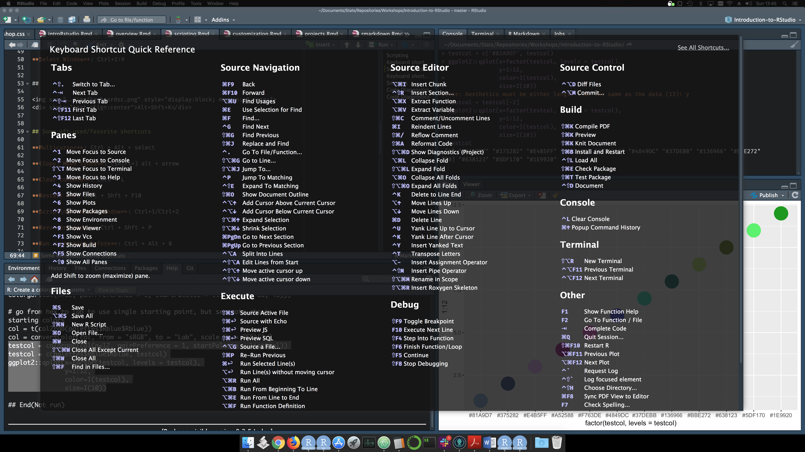

Intro to R Studio
========================================================
author: A Center for Social Research Production
autosize: true
transition: linear
css: workshop.css
font-family: 'Helvetica'

========================================================

Overview
========================================================
type:prompt
css: workshop.css

========================================================

Base R is an extremely powerful tool.

The syntax editor in Base R is awful.

You should use something more efficient and easy to use.

Options:

- Rstudio
- Emacs
- Vim
- Various others


========================================================
Rstudio's strength is in assuming an interactive session from the outset.

Emacs is especially powerful and useful (though at its core, a text editor rather than IDE).

- Some of the R-core maintain Emacs Speaks Statistics

However, there is an Emacs (and Vim) mode within Rstudio.

- Bring that editing approach to Rstudio with you

You still might want RStudio for documents/presentation.

- $\LaTeX$ isn't everything!


========================================================
transition: fade
Rstudio offers:

- Code completion and snippets
- Code diagnostics
- Customizable shortcuts
- Document generation (web, pdf, presentation, .doc)

    -Spell check

- Web publishing


========================================================
transition: fade
Rstudio offers:

- Enhanced debugging
- Navigable data frames
- Version control
- Interactive visualization
- Addins


========================================================
Rstudio is an excellent tool for reproducible research.

- Project management
- Package building and freezing
- Document generation

In short, you can go from data import to (modern, web-based) publication and replication.


========================================================


Scripting
========================================================
type:prompt

Scripting
========================================================
Everyone who uses Rstudio does so for easier scripting, including:

- Syntax highlighting
- Autocomplete of object/function names, etc.
- Autopairing of parenthesis, quotes etc.
- Auto indent

It even makes working at the console viable.

- Still not advised


Keyboard shortcuts: standard scripts
========================================================
left: 60%
Knowing a few <span class="emph">shortcuts</span> can save *a lot* of time in the long run.

Examples (Windows and Linux):
Run current line: Ctrl+Entr

Run up to/from current line: Ctrl+Alt+B/Ctrl+Alt+E

Run everything: Ctrl+Shft+Entr

Insert section: Ctrl+Shft+R
***

<div style="text-align:center">Alt+Shft+K</div>

Keyboard shortcuts: standard scripts
========================================================
Copy up/down: Ctrl+Shft+up/down

Move up/down: Shft+up/down

Yank up to cursor: Ctrl+u

Yank after cursor: Ctrl+k

Select multiple lines: Ctrl+Alt+Click

Select Window: Ctrl+1:9

Expand Window: Ctrl+Shft+1:9


Keyboard shortcuts: tabs
========================================================
Previous tab: Ctrl+F11

First tab: Ctrl+Shft+F11

Next tab: Ctrl+F12

Last tab: Ctrl+Shft+F12


Keyboard shortcuts: documents
========================================================
Insert Chunk: Ctrl+Alt+i

Run Chunk: Ctrl+Alt+c

Run previous chunks: Ctrl+Alt+p

Knit document: Ctrl+shft+k


Keyboard shortcuts
========================================================

The point is, knowing just a dozen shortcuts could save a lot of time.

Bonus: Ctrl+Shft+a (tidy up your code)

Mac users: most of these would use Cmd rather than Ctrl (but not always)


Snippets
========================================================
left: 65%

Snippets allow one to insert code of a certain form for commonly used functions.

You only have to type the first couple letters, the form of the rest of the code will fill out, then you can tab your way through the rest of it.


```r
name <- function(variables) {

}

for (variable in vector) {

}

apply(array, margin, ...)
```

***


Code Diagnostics
========================================================
left:50%
Rstudio will note problems in your code in the margin.

- Examples: hanging brackets, too many commas etc.

This works beyond just R scripts too!
***


========================================================

Debugging
========================================================
type:prompt
css: workshop.css

What is Debugging?
========================================================

Debugging is merely finding and fixing problematic code.

  - Code will always have bugs

Debugging is an absolutely essential part of creating functions.

Debugging in RStudio
========================================================

There are numerous facilities within R to help you debug your code.

As with everything, RStudio makes the whole process easier.

 - RStudio also has numerous facilities for debugging.


Overview
========================================================
incremental: true

Break Points

<span class="func">browser()</span>

<span class="func">debugonce()</span>


Breakpoints
========================================================

Editor breakpoints are used to enter into debugging at a certain line.

Breakpoints are created by clicking next to a line number in a function.

You must <span class="func">source()</span> the function before the breakpoints will be implemented

browser()
========================================================

Used to stop a function at a certain point and enter into debugging.

  - Essentially a hard-coded editor breakpoint


```r
wackyAvg = function(a, b, c, d, e, f) {
  resSum = (a * .5) + (b * 2.5) + (c * 4.5) + (d * 6.5) + (e * 8.5) + (f * 10.5)
  browser()
  wackAvg = resSum / 6
  print(wackAvg)
}
```

debug() and debugonce()
========================================================

As opposed to specifying breakpoints or including a <span class="func">browser()</span> line, <span class="func">debug()</span> will start from the top and work through each line.

The <span class="func">debug()</span> function will run everytime you run the function.

  - You will have to <span class="func">undebug()</span> to break this behavior

Using <span class="func">debugonce()</span> will keep that loop from starting.


debug()
========================================================


```r
wackyAvg = function(a, b, c, d, e, f) {
  resSum = (a * .5) + (b * 2.5) + (c * 4.5) + (d * 6.5) + (e * 8.5) + (f * 10.5)
  wackAvg = resSum / 6
  print(wackAvg)
}

debug(wackyAvg)

wackyAvg(1, 2, 3, 4, 5, 6)

undebug(wackyAvg)
```


debugonce()
========================================================


```r
wackyAvg = function(a, b, c, d, e, f) {
  resSum = (a * .5) + (b * 2.5) + (c * 4.5) + (d * 6.5) + (e * 8.5) + (f * 10.5)
  wackAvg = resSum / 6
  print(wackAvg)
}

debugonce(wackyAvg)

wackyAvg(1, 2, 3, 4, 5, 6)
```


Debug Mode Commands
========================================================
left: 50%

There are commands that allow you to work through debugging:

- Next (n): runs the next line

- Step into (s): if the next line is a new function, it enters into the function

  - Careful with this one; you can get pretty far into other functions

- Finish (f): finishes the function

***

- Continue `(c)`: stops debugging and runs the function

- Stop (Q): stops debugging and does not run the function

Each of these also has a button in the debugging menu


Quick Wrap
========================================================
incremental: true

Debugging is an important part of programming.

RStudio makes the debugging more interactive and flexible than R alone.


========================================================

Addins
========================================================
type:prompt
css: workshop.css

========================================================


R Studio allows its users to create functions that can be used within R Studio with a click or keystroke.

These special functions are called addins.

Addins are a great way to increase your productivity and efficiency when scripting.

They can be anything, but the easiest (and perhaps most useful) example is text insertion/formatting.


Creating Addins
========================================================
incremental: true

Addins are nothing more than R functions that you can call interactively.


```r
insertMatrix = function() {
  rstudioapi::insertText("[[Question:Matrix]]\n\n[[Choices]]\n\n[[Answers]]")
}
```

```
insertMatrix()

[[Question:Matrix]]

[[Choices]]

[[Answers]]
```


Steps
========================================================
incremental: true

To make addins available within your RStudio, you need to do the following:

- Create an R package

- Create R functions for the addins

- Create a debian control file (.dcf) at a specific location


Debian Control File?
========================================================

We do not need to worry about what exactly is happening with these.

Just create the following folders and file:

- ~/inst/rstudio/addins.dcf


Register the Addins
========================================================

To include the addins in the .dcf, you need to include the following information:

  - Name: What should appear as the addin name

  - Description: A brief description

  - Binding: The function name

  - Interactive: Logical for interactivity


An Example
========================================================
```
Name: Insert [[Question:Matrix]]
Description: Inserts a matrix question into the advanced format text file.
Binding: insertMatrix
Interactive: false
```
- You can include any number of addins within the file, just leave a blank line between each entry.


Interactive
========================================================
We can use <span class="pack">shiny</span> to create interactive addins.

- Just set interactive to true.

The <span class="pack">addinexamples</span> package has a few good examples of interactive addins.


R Package
========================================================
incremental: true

Addins have to be put inside of an R package to function.

- It could be a package with nothing but addins if you want.

Once the addins are included, they will be there until you decide to remove them.

- You do not need to do anything special to load the addins!

Using 'rstudioapi'
========================================================

The <span class="pack">rstudioapi</span> package offers some functions to create addins.

The <span class="func">insertText</span> function is one that you will probably use the most.

- There are a few others that you might find useful:

  - <span class="func">modifyRange</span> - does the same thing as <span class="func">insertText</span>, but over ranges.

  - <span class="func">navigateToFile</span> - opens a file within RStudio (you can even specify the line)

  - <span class="func">askForPassword</span> - requires the user to input a password

Shortcuts
========================================================
Being able to interactively call functions is handy.

To make the most out of the addins, you can assign each one a keyboard shortcut.

- Addins > Browse Addins > Keyboard Shortcuts...

You can set them to be whatever you want!


"Gotcha's" and Tips
========================================================

Always make sure that the binding and the function name are the same.

- You will get an error if there is not a match.

Rebuild the package if you add more functions.

It never hurts to restart your R session if you have multiple projects open.


Quick Wrap
========================================================

RStudio addins can save you a lot of time on tasks that you frequently do.

Like most things, a little initial work will yield massive time savings in the future.


========================================================

Package Development
========================================================
type:prompt
css: workshop.css

========================================================

RStudio makes package development easy.

- New Project > New Directory > R Package


R Package Dialog Box
========================================================

"Create package based on source files:" allows you to include previously written functions in your new package.

When the package gets created, each of the functions you added at this step will have their own help files created.

  - You will still need to complete the help files, but at least they are there.

  - Do keep in mind that you need a $\LaTeX$ installation for help files!

What You Get
========================================================
R Studio will automatically start you out with the following:

  - DESCRIPTION: Just like every R package

  - A 'man' folder: Contains .Rd files for each function

  - An 'R' folder: Contains your functions.

You might also consider adding an .md file if you want to put your package on GitHub.


Function Documentation
========================================================

The <span class="pack">roxygen2</span> package helps to properly format your documentation files.

It will give you pre-formatted .Rd files that already contain your arguments:

```
\arguments{
  \item{x}{
%%     ~~Describe \code{x} here~~
}
  \item{y}{
%%     ~~Describe \code{y} here~~
}
}
```

All you need to do is add explanatory text and working examples.

Build & Reload
========================================================

After you have all of your files ready, you can build the package.


Check
========================================================

Packages tend to have a lot happening in them.

To help you make sure that the package has everything it needs, you can run the <span class="func">check</span> function from <span class="pack">devtools</span> on it.

It will check package quality across many dimensions:

  - Ability to install package and its dependencies

  - Checking help file quality

  - Find errors in examples

All of this testing will occur within the "Build" pane and you can see errors as they occur.

You can also look at the log file that is produced.


Demonstration
========================================================


Quick Wrap
========================================================

RStudio has built-in tools that make package creation a straight-forward process.

You should not be afraid to create your own packages.


========================================================

Version Control
========================================================
type:prompt
css: workshop.css

Overview
========================================================

RStudio offers the ability to integrate version control into your project.

  - Subversion
  - Git
  - Both are free and open

Wait, Wait! What Is Version Control?
========================================================
incremental: true

At its most basic, it is just a way to manage changes.

  - Documents, code, etc.

Especially useful when collaborating.

  - Keep track of who is making changes and what they are changing
  - Revert changes back to an earlier version
  - Merging multiple copies of a document into one


Subversion
========================================================

Subversion (SVN) is "client-server" program.

  - Users share a single repository

Git
========================================================
incremental: true

Git works on a distributed model

  - Users create their own local repositories

Created by the folks at Linux

The Baskin Robbins of version control

  - Bitbucket
  - GitLab
  - GitHub

GitHub
========================================================

GitHub is a web-based tool that allows you to upload your Git repository

Process (Briefly)
========================================================
incremental: true

  - Commit
  - Push into repository
  - Pull from repository

The Shell
========================================================
incremental: true

RStudio has you covered for most commands.

If you need other things, RStudio will pull up the shell for you:

  - commit --amend - Redoing a commit
  - branch - Create a new branch
  - merge - Merges the current branch into the Master
  - log (--oneline) - Shows all commits (in one line)
  - tag - Label a branch as an important one
  - rm - Remove a file
  - stash -  Stash a file to avoid making changes when pulling
  - blame - Find out who made changes to a file


A Common Shell Use
========================================================

Sometimes, we create our local repository before creating our remote repository in GitHub

  - Excitement often gets the best of us!

If you want to push your local repository to a new remote repository, just use the following:


```engine
$ git remote add origin git@github.com:user--/repo.git

$ git push origin master
```


Lightning Demo
========================================================

**Various Shenanigans**

Quick Wrap
========================================================

RStudio makes it easy to integrate version control into your project.

You have nothing to lose by keeping track of files and the changes that have been made to them.

This is especially useful when collaborating.


========================================================

Interactive and Visual Data Exploration
========================================================
type:prompt
css: workshop.css

The Viewer
========================================================

In addition to the "Plots" pane, RStudio also provides a "Viewer" pane.

Anything interactive will be displayed there.

Packages
========================================================

A few important packages:

  - <span class="pack">ggvis</span>

  - <span class="pack">rbokeh</span>

  - <span class="pack">DT</span>

Interactive Tables (View)
========================================================

RStudio now gives you a sortable table with the <span class="func">View</span> function.

  - <span class="func">View</span> just like you would otherwise use


```r
View(state.x77)
```


Interactive Tables With 'DT'
========================================================

The <span class="pack">DT</span> package allows you to create interactive data tables.

These tables will open in your viewer:

  - They also work nicely within R Markdown and similar formats

    - They don't, however, work in ioslides!

Checking Your Data
========================================================

It is always a good idea to give your data a visual pass.


```r
DT::datatable(state.x77)
```

Identify anomolies, nonsense values, etc.

Other Things To Check
========================================================

Summaries


```r
cbind(data.frame(state.x77), state.division) %>%
  group_by(state.division) %>%
  summarize(meanPop = round(mean(Population), 2),
            meanMurder = round(mean(Murder), 2)) %>%
  DT::datatable()
```

Correlation Tables


```r
data.frame(state.x77) %>%
  cor() %>%
  round(2) %>%
  DT::datatable()
```


Some Additional Functionality
========================================================

The <span class="func">datatable</span> function also has an argument to filter your data.


```r
DT::datatable(cbind(data.frame(state.x77), state.division), filter = "top")
```

Same as above, but with division as a string:


```r
DT::datatable(cbind(data.frame(state.x77), as.character(state.division)), filter = "top")
```

Interactive Plots
========================================================

RStudio, in conjunction with some modern packages, lets you visually explore your data.

There are two packages that are great for this:

  - <span class="pack">ggvis</span>

  - <span class="pack">rbokeh</span>

ggvis
========================================================
With <span class="pack">ggvis</span>, you can take some of what you know from <span class="pack">ggplot2</span> and use it to create interactive, web-ready plots.

  - Instead of building layers with <span class="func">+</span>, <span class="pack">ggvis</span> imports the <span class="func">%>%</span> operator from <span class="pack">magrittr</span>.


ggvis
========================================================


```r
library(ggvis)

cbind(data.frame(state.x77), state.division) %>%
  ggvis(~ Illiteracy, ~ Income) %>%
  layer_points(fill = ~ state.division) %>%
  layer_smooths(span = input_slider(.2, 1))
```


rbokeh
========================================================

The <span class="pack">rbokeh</span> package is a port of the 'bokeh' package from Python.

It is very similar to <span class="pack">ggvis</span>, but there are some distinct differences.

An Example
========================================================


```r
library(rbokeh)

cbind(data.frame(state.x77), state.name) %>%
  figure() %>%
  ly_points(x = Illiteracy, y = Income,
            color = state.division,
            hover = state.name) %>%
  ly_lines(lowess(x = Illiteracy,
                  y = Income))
```


Which One?
========================================================

It might be easier to get up and going with <span class="pack">rbokeh</span>.

On the other hand, <span class="pack">ggvis</span> is incredibly powerful and is ready to go into any <span class="pack">shiny</span> app.


Quick Wrap
========================================================

RStudio lets you take a deeper look at your data.

Interactive tables and plots go a long way to helping you understand your data better.


========================================================

Cheat Sheets
========================================================
type:prompt
css: workshop.css

Cheat Sheets - RStudio Style
========================================================

RStudio wants everything to be easy for us as R users.

  - They do not mind that the kids (or rapscallions as Ripley would likely call them) are playing on the lawn.

As such, they have produced a series of cheat sheets as reference material.

https://www.rstudio.com/resources/cheatsheets/


RStudio
========================================================
incremental: true

RStudio has a cheatsheet for using RStudio!

It provides a high-level overview for many of the things we are talking about here.

It also has a comprehensive list of keyboard shortcuts.

  - Alt + Shift + K will bring them up in RStudio.
  - Shortcuts can save you a lot of time.
  - Do show care in your keystrokes...otherwise, you might find your screen rotated or your keyboard is producing Hebrew characters.


Data Visualization
========================================================

It is essentially a primer on using <span class="pack">ggplot2</span>.

It effectively communicates the various geoms.

For the beginning ggplot2 user, the following sections are indispensable:

- Scales
- Coordinate Systems
- Faceting
- Position Adjustments


Data Wrangling
========================================================
incremental: true


Data wrangling is essentially just a fun way of saying data cleaning and prep.

The cheat sheet offers some useful tips on using two handy packages:

- <span class="pack">dplyr</span>

  - Handles all manners of data subsetting, filtering, variable selections, grouping, summarizing, etc.

- <span class="pack">tidyr</span>

  - Used for reshaping data (wide to long, long to wide).

R Markdown
========================================================

R Markdown is used to generate reproducible documents with R.

Your document can contain code, data, analyses, visualizations, or anything else that you want to include.

You may also include html, css, javascript, and $\LaTeX$ in your documents.

R Markdown documents can be saved as html, pdf, or even Word documents.


R Markdown Reference Guide
========================================================

R Markdown is really a combination of three different things:

- markdown

  - The basic structure of the document (headings, sections, text)

- <span class = "pack">knitr</span>

  - Controls how R is used within the document

- pandoc

  - Controls the output (html, pdf; document, presentation)

  - The last page list each format and the options that are available


Package Development
========================================================

RStudio makes package development accessible to anyone.

It has many capacities for helping you to create packages:

- automatic file creation with <span class="pack">roxygen2</span>

The cheat sheat details using <span class="pack">devtools</span>.

- devtools was created specifically for package development


Shiny
========================================================

Shiny is a web page that allows users to interact with an R session.

  - Users can interact with the data, models, visualizations, etc.


Quick Wrap
========================================================
incremental: true

RStudio wants to make things easy on you!

Having a handy copy of the cheat sheets will serve you well!
