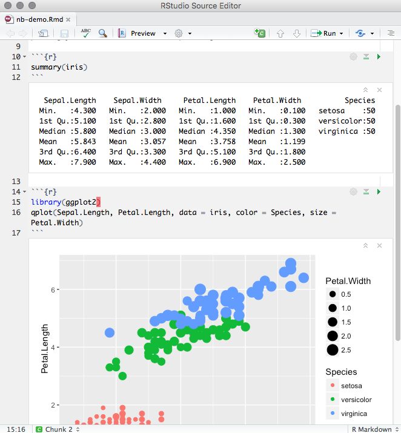

## 

<h1>Notebooks<h1>

## Notebooks

Notebooks provide a different way to interact with R.

Previously one could save out some files as a 'notebook'.

Now one can start an interactive R script.

- chunks of R code can be executed independently as needed

Output is visible at the point where the code is written. 

## Notebooks

File/New File/R Noteboook...

## Notebooks

You may still want to use (or prefer) the console

-  But you don't have to.

The viewer will allow for previews of the final document.

## Notebooks

Notebooks are a different flavor of Rmarkdown document.

Good for sharing your work.

See also, Jupyter.