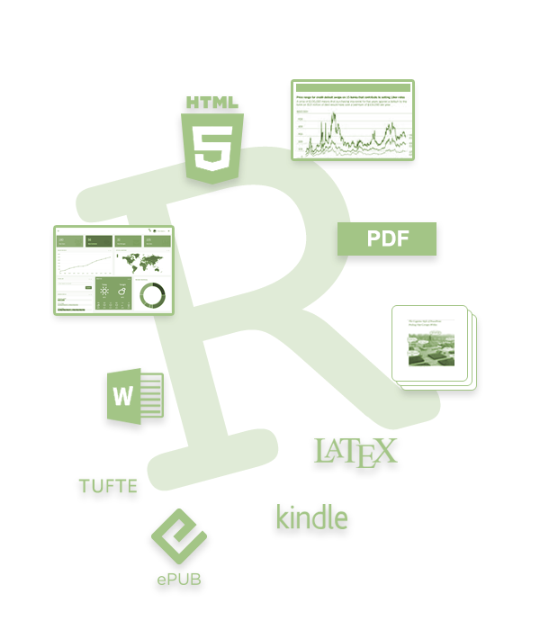

## 

<div style='text-align: center; font-size:32'><h1>R Markdown<h1></div>


##

<div style='text-align: center; font-size:32'>
<h1>Overview<h1>

</div>


## What is R?
<div style='font-size:90%'>
R is Not just for statistics anymore!

- a general programming environment 

<div class="col2" style='font-size:100%'>
<span class="emph">Markdown</span> is a markup language.
<br><br>

</div>
- Allows for easier web-based documentation
- Not necessary to know html
- Lots of things will use it
- <span class="emph">R Markdown</span> is a flavor

Now one can intermingle R code with markdown, <span class="emph">html</span>, <span class="emph">css</span>, <span class="emph">JavaScript</span>, <span class="emph">$\LaTeX$</span> and others resulting in a variety of products.
</div>

## R Markdown

RStudio and R Markdown make it easy to construct:

- html, pdf, MS Word documents
- presentations (like this one)
- dashboards
- notebooks
- websites
- other publications

<div style='text-align:center'>

<span class="emph" style="font-variant:small-caps; font-size:125%; text-align:center">*Literate programming!*</span>

<span class="emph" style="font-variant:small-caps; font-size:125%">*Reproducible research!*</span>
</div>


## Example

R <span class="emph">chunks</span> are interspersed throughout the Rmd file.

R Markdown documents combine:

- code
- plain text
- markdown 
- other

```{r, eval=FALSE}
print("This is an R chunk, in a slide, of the presentation you're looking at!")
```

W

## R Markdown

Once ready, <span class="emph">knit</span> the document into the format your want.

- Ctrl/Cmd-Shft-K

See the R Markdown workshop for more details... 

- https://m-clark.github.io/Introduction-to-Rmarkdown/

and the main R Markdown reference text...

- https://bookdown.org/yihui/rmarkdown/


## Examples

[m-clark.github.io/generalized-additive-models/](https://m-clark.github.io/generalized-additive-models/)

[m-clark.github.io/bayesian-basics/](https://m-clark.github.io/bayesian-basics)