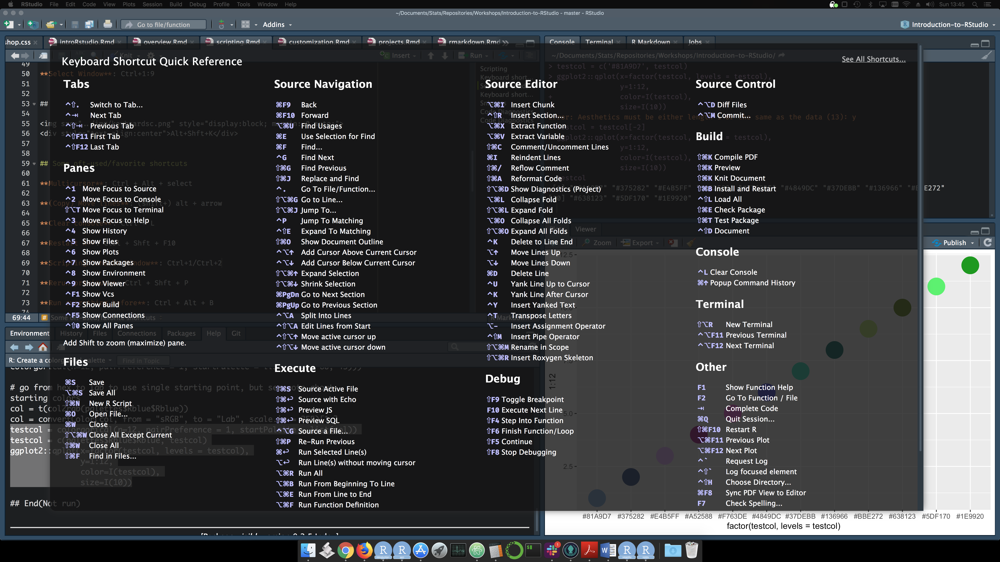
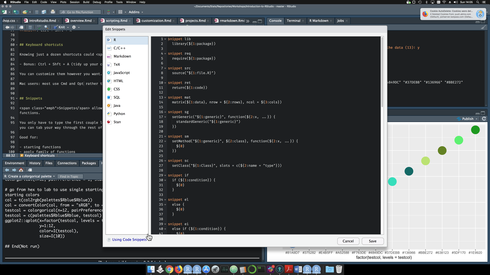

## 

<div style='text-align: center; font-size:32'><h1>Scripting<h1></div>


## Scripting

Everyone who uses RStudio benefits from easier scripting:

- <span class="emph">Syntax highlighting</span>
- <span class="emph">Autocomplete</span> of object/function names, etc.
- <span class="emph">Autopairing</span> of parenthesis, quotes etc.
- <span class="emph">Auto indent</span> 

It even makes working at the console viable.

- Still not advised


## Keyboard shortcuts: standard scripts

Knowing a few <span class="emph">shortcuts</span> can save *a lot* of time in the long run.

Examples (Windows and Linux):

**Run current line**: Ctrl+Entr

**Copy up/down**: Ctrl+Shft+up/down

**Move up/down**: Shft+up/down

**Run everything**: Ctrl+Shft+Entr

**Insert section**: Ctrl+Shft+R

**Select Window**: Ctrl+1:9


##


<div style="text-align:center">Alt+Shft+K</div>


## Some oft-used/favorite shortcuts

**Multicursor**: Ctrl + Alt + select

**(Copy) Move lines**: (shift+) alt + arrow

**Clear console**: Ctrl + L

**Restart R**: Ctrl + Shft + F10

**Scripting/Console Window**: Ctrl+1/Ctrl+2

**Rerun previous**: Ctrl + Shft + P

**Run everything before**: Ctrl + Alt + B

**Run everything before**: Ctrl + Alt + E

**Knit**: Ctrl + Shft + K


## Keyboard shortcuts

Knowing just a dozen shortcuts could <span class="emph">*save a lot of time*</span>.

- Bonus: Ctrl + Shft + A (tidy up your code)

You can customize them however you want.

Mac users: most use Cmd and Opt rather than Ctrl and Alt


## Snippets

<span class="emph">Snippets</span> allow one to insert code of a certain form for commonly used functions.

You only have to type the first couple letters, the form of the rest of the code will fill out, then you can tab your way through the rest of it.

Good for:

- starting functions
- apply family of functions
- even for other languages


```{r snippetDemo, eval=FALSE}
name <- function(variables) {

}

for (variable in vector) {

}

apply(array, margin, ...)
```

***


<br>


## Snippets



## Code Diagnostics

RStudio will note problems in your code in the margin.

- Examples: hanging brackets, too many commas etc.

This works beyond just R scripts too!

## Code Diagnostics


